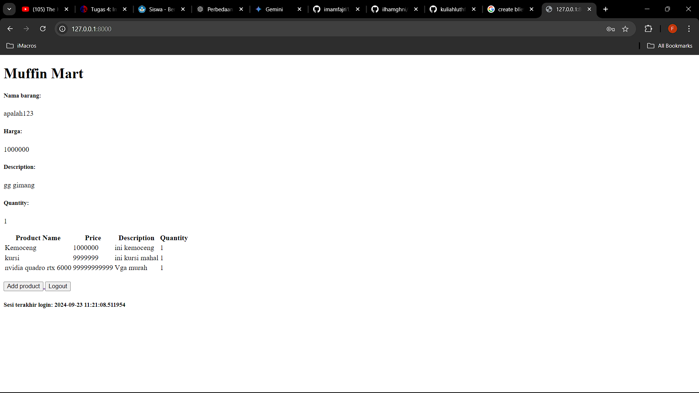
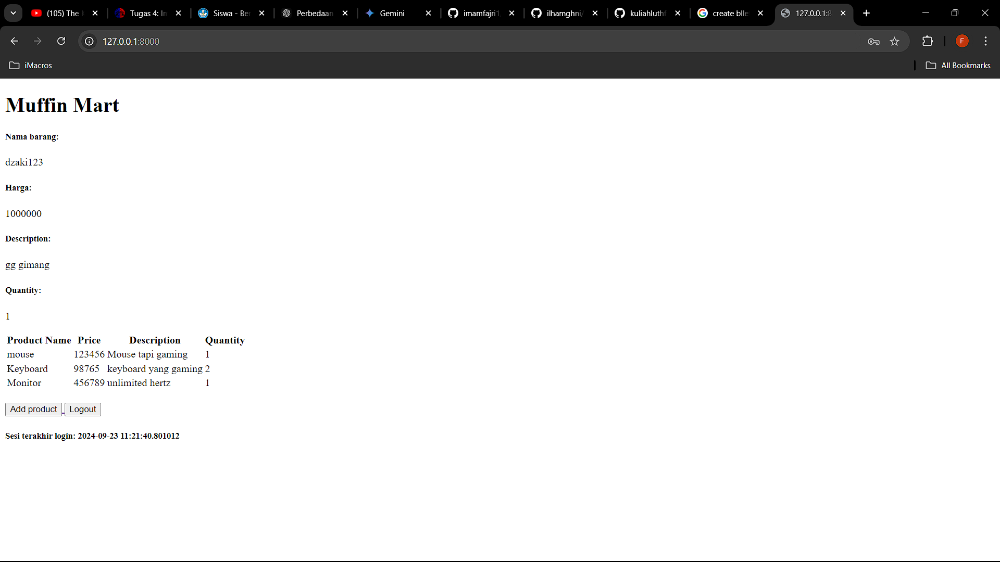
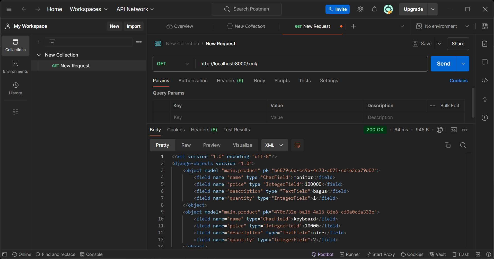
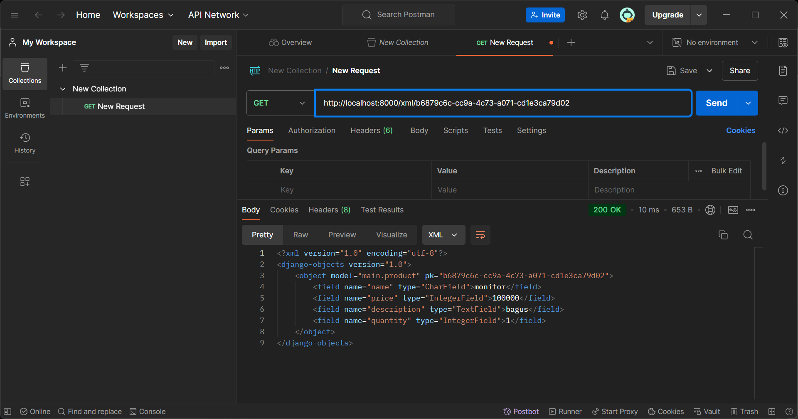
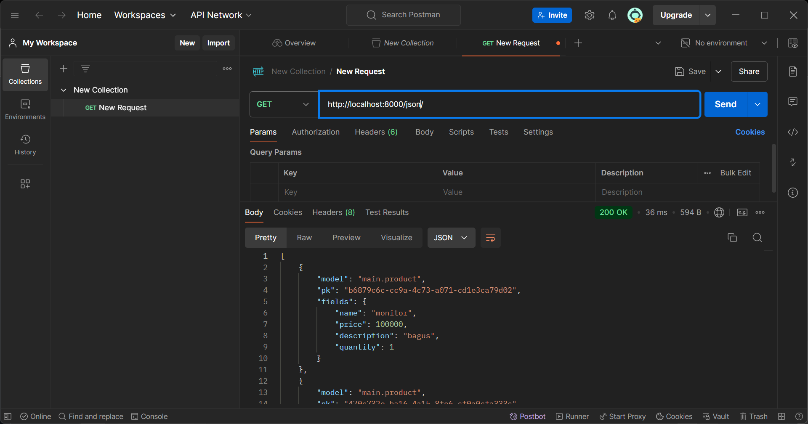
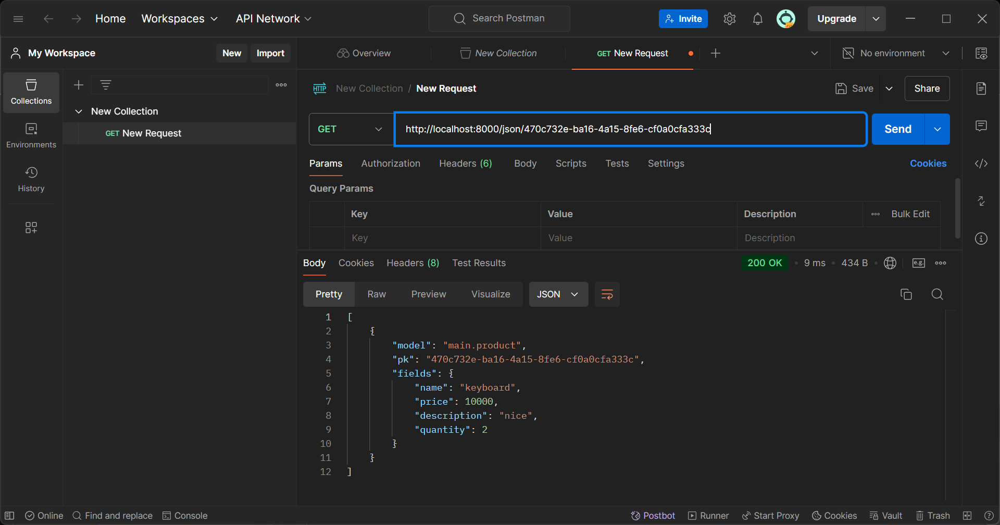
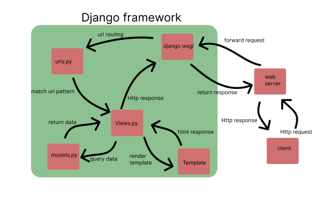

# Muffin Mart
## Nama : Fadhlurohman Dzaki
## Npm : 2306202132
## Link : http://fadhlurohman-dzaki-muffinmart.pbp.cs.ui.ac.id/

# Tugas 6: JavaScript dan AJAX
<details>
<summary>Click for more detail</summary>
<br>

### Jelaskan manfaat dari penggunaan JavaScript dalam pengembangan aplikasi web!
JavaScript memiliki peran penting dalam pengembangan aplikasi web karena kemampuannya untuk membuat halaman lebih interaktif dan responsif. Dengan JavaScript, elemen-elemen pada halaman web dapat diubah secara dinamis tanpa perlu memuat ulang halaman, misalnya saat melakukan validasi form atau memperbarui konten menggunakan AJAX. Hal ini menciptakan pengalaman yang lebih cepat dan efisien bagi pengguna.

Selain itu, JavaScript memungkinkan pengembangan aplikasi berbasis web yang lebih interaktif melalui manipulasi DOM (Document Object Model), sehingga tampilan dan konten halaman dapat berubah sesuai dengan aksi pengguna. Framework dan pustaka populer seperti React dan Vue.js juga membantu pengembang membangun aplikasi web kompleks dengan lebih mudah dan efisien.

JavaScript juga kompatibel dengan semua browser utama dan, dengan adanya Node.js, dapat digunakan untuk pengembangan full-stack, baik di sisi klien maupun server. Dengan komunitas yang besar dan ekosistem yang kuat, JavaScript terus menjadi salah satu bahasa utama dalam pengembangan web modern.

### Jelaskan fungsi dari penggunaan await ketika kita menggunakan fetch()! Apa yang akan terjadi jika kita tidak menggunakan await?
Fungsi dari penggunaan await saat menggunakan fetch() adalah untuk menunggu hingga Promise yang dihasilkan oleh fetch() selesai (berhasil atau gagal) sebelum melanjutkan eksekusi ke baris kode berikutnya. fetch() melakukan operasi HTTP secara asinkron dan mengembalikan Promise, yang berarti bahwa kode di bawahnya akan berjalan sebelum hasil fetch() tersedia jika kita tidak menggunakan await.

Jika kita tidak menggunakan await, Promise yang dikembalikan oleh fetch() akan segera diterima, tetapi data belum tersedia. Kode di bawahnya akan berjalan sebelum permintaan selesai, yang bisa menyebabkan kesalahan saat mencoba mengakses data yang belum tersedia.

anpa await, fetch() akan mengembalikan sebuah Promise, bukan hasil respons HTTP, sehingga kita tidak bisa langsung menggunakan data yang diinginkan tanpa menggunakan .then() atau await untuk menunggu penyelesaiannya. Akibatnya, kita mungkin mencoba mengakses data yang belum tersedia, yang bisa menyebabkan bug / error.
### Mengapa kita perlu menggunakan decorator csrf_exempt pada view yang akan digunakan untuk AJAX POST?
Kita perlu menggunakan decorator csrf_exempt pada view yang digunakan untuk AJAX POST jika request tersebut tidak mengirimkan token CSRF. Hal ini penting karena Django secara default mengaktifkan proteksi CSRF (Cross-Site Request Forgery) pada setiap request POST, untuk mencegah serangan di mana pihak ketiga dapat memalsukan request atas nama pengguna yang sedang login.

Jika request POST dilakukan menggunakan AJAX dan tidak menyertakan token CSRF, Django akan menolak request tersebut dan mengembalikan 403 Forbidden karena dianggap sebagai permintaan yang berpotensi berbahaya. Dengan menambahkan @csrf_exempt, kita memberitahu Django untuk mengecualikan proteksi CSRF pada view tertentu sehingga AJAX POST bisa diproses tanpa memverifikasi token CSRF.
### 
Pembersihan data input pengguna di backend diperlukan untuk menjaga keamanan dan integritas aplikasi. Jika hanya dilakukan di frontend, pengguna yang berniat jahat dapat memodifikasi atau mengabaikan validasi pada browser dan mengirim data berbahaya ke server, yang berisiko menyebabkan serangan seperti SQL injection atau XSS. Oleh karena itu, backend perlu memvalidasi dan membersihkan data untuk mencegah manipulasi tersebut.

Selain itu, backend memastikan konsistensi data di seluruh aplikasi, terlepas dari perangkat atau platform yang digunakan pengguna. Validasi di sisi server menjamin bahwa data yang diterima selalu sesuai dengan aturan bisnis, meskipun ada variasi dalam perilaku browser atau jika data dikirim langsung melalui API. Dengan begitu, aplikasi tetap aman dan data yang diproses selalu valid.
### Jelaskan bagaimana cara kamu mengimplementasikan checklist di atas secara step-by-step (bukan hanya sekadar mengikuti tutorial)!
</details>


# Tugas 5: Desain Web menggunakan HTML, CSS dan Framework CSS
<details>
<summary>Click for more detail</summary>
<br>

### Jika terdapat beberapa CSS selector untuk suatu elemen HTML, jelaskan urutan prioritas pengambilan CSS selector tersebut!
Dalam CSS, terdapat beberapa faktor yang mempengaruhi prioritas (specificity) sebuah selector ketika diterapkan pada elemen HTML. Urutan prioritas tersebut adalah sebagai berikut:

1. Inline Styles: Gaya CSS yang diterapkan langsung pada elemen menggunakan atribut style. Ini memiliki prioritas tertinggi.
2. ID Selector: Selector yang menggunakan ID memiliki prioritas lebih tinggi daripada class, attribute, atau pseudo-class selector. Contoh: #header.
3. Class, Attribute, dan Pseudo-class Selector: Selector yang menggunakan class (.class-name), attribute ([type="text"]), atau pseudo-class (:hover) berada di urutan setelah ID.
4. Tag Selector (Element Selector): Selector yang hanya menggunakan nama elemen HTML, seperti div, memiliki prioritas paling rendah.
5. Universal Selector (*), combinator (+, >, ~), dan pseudo-element (::before, ::after) memiliki prioritas yang lebih rendah daripada yang disebutkan di atas.

CSS juga dipengaruhi oleh order of appearance (urutan penulisan). Jika dua selector memiliki prioritas yang sama, CSS yang dideklarasikan paling akhir dalam file akan diterapkan.

###  Mengapa responsive design menjadi konsep yang penting dalam pengembangan aplikasi web? Berikan contoh aplikasi yang sudah dan belum menerapkan responsive design!
Responsive design adalah teknik dalam pengembangan web yang memungkinkan website untuk menyesuaikan tampilannya berdasarkan ukuran layar perangkat yang digunakan (mobile, tablet, desktop, dll.). Ini menjadi penting karena saat ini, banyak pengguna mengakses website dari berbagai jenis perangkat, terutama dari ponsel.
Menggunakan responsive design dapat meningkatkan user experience dan aksesibilitas, serta membantu peringkat SEO di mesin pencari seperti Google.

Contoh Aplikasi yang Menerapkan Responsive Design:
* Tokopedia: Menggunakan responsive design untuk memastikan pengguna di perangkat mobile memiliki pengalaman yang optimal sama seperti pengguna di desktop.

* Contoh yang Belum Menerapkan: Beberapa website lama dan beberapa website pemerintahan di Indonesia
### Jelaskan perbedaan antara margin, border, dan padding, serta cara untuk mengimplementasikan ketiga hal tersebut!
* Margin: Ruang kosong di luar border elemen. Margin menciptakan jarak antara elemen tersebut dengan elemen lain di sekitarnya.
Contoh:
```css
Copy code
.box {
  margin: 20px;
}
```

* Border: Batas atau garis yang mengelilingi elemen. Border diletakkan di antara margin dan padding.
Contoh:
```css
Copy code
.box {
  border: 2px solid black;
}
```
* Padding: Ruang di dalam elemen, antara konten elemen dan border. Padding menambah ruang dalam elemen itu sendiri.
Contoh:
```css
Copy code
.box {
  padding: 10px;
}
```
Jadi, jika sebuah elemen memiliki konten di dalamnya, padding menambahkan ruang di sekitar konten, border menutupi elemen tersebut, dan margin menambah ruang di luar elemen tersebut.

### Jelaskan konsep flex box dan grid layout beserta kegunaannya!
1. Flexbox adalah sistem tata letak satu dimensi yang digunakan untuk menyusun elemen secara fleksibel di dalam kontainer, baik secara horizontal maupun vertikal. Flexbox sangat berguna untuk membuat tata letak yang responsif dan seimbang secara otomatis.Kegunaan: Flexbox cocok digunakan ketika ingin mengatur elemen dalam satu baris atau kolom, seperti membuat navigasi, tombol, atau kartu produk yang bisa disusun ulang sesuai ukuran layar.


2. Grid layout adalah sistem tata letak dua dimensi yang memungkinkan pengaturan elemen dalam baris dan kolom secara bersamaan. Grid sangat berguna untuk membuat tata letak yang lebih kompleks, seperti halaman web yang memiliki header, sidebar, konten utama, dan footer.Kegunaan: Grid cocok untuk struktur yang lebih kompleks, seperti tata letak halaman web yang memiliki banyak elemen dengan ukuran yang berbeda-beda.

### Jelaskan bagaimana cara kamu mengimplementasikan checklist di atas secara step-by-step (bukan hanya sekadar mengikuti tutorial)!
1. Membuat fitur untuk edit product dan delete product langkah awal membuat fungsi di views.py.Untuk edit product buat edit_product_entry.html agar saat mengedit diarahkan ke laman edit product.
```python
def edit_product(request, id):
    # Get mood entry berdasarkan id
    product = Product.objects.get(pk = id)

   
    form = ProductForm(request.POST or None, instance=product)

    if form.is_valid() and request.method == "POST":
        # Simpan form dan kembali ke halaman awal
        form.save()
        return HttpResponseRedirect(reverse('main:show_main'))

    context = {'form': form}
    return render(request, "edit_product.html", context)


def delete_product(request, id):
    # Get product berdasarkan id
    product = Product.objects.get(pk = id)
    # Hapus mood
    product.delete()
    # Kembali ke halaman awal
    return HttpResponseRedirect(reverse('main:show_main'))
```
```html




<title>Edit Product</title>




<div class="min-h-screen flex items-center justify-center" style="background-color: #8B4513;">
  <div class="bg-white p-8 rounded-lg shadow-lg w-full max-w-md border-2 border-black">
    <h1 class="text-3xl font-bold text-black mb-6 text-center">Edit Product</h1>

    <form method="POST" class="space-y-4">
      
      
      <div class="space-y-4">
        
          <div>
            <label for="{{ field.id_for_label }}" class="block text-black font-bold mb-2">{{ field.label }}:</label>
            {{ field }}
            
              <p class="text-red-500 text-sm mt-1">{{ field.errors.0 }}</p>
            
            <style>
              #{{ field.id_for_label }} {
                width: 100%;
                border: 2px solid black;
                border-radius: 0.25rem;
                padding: 0.5rem 0.75rem;
              }
              #{{ field.id_for_label }}:focus {
                outline: none;
                ring: 2px;
                ring-color: #EAB308;
                border-color: black;
              }
            </style>
          </div>
        
      </div>

      <div class="flex justify-center">
        <input class="w-full bg-yellow-500 hover:bg-orange-600 text-white font-bold py-2 px-4 rounded transition duration-300 ease-in-out cursor-pointer" type="submit" value="Edit Product" />
      </div>
    </form>

    
    <ul class="mt-4 text-center">
      
      <li class="text-red-500">{{ message }}</li>
      
    </ul>
    
  </div>
</div>

```
2. import kedua fungsi tersebut ke urls.py da tambahkan pathnya juga agar bisa digunakan.Jangan lupa juga tambahkan dua tombol untuk edit dan hapus tadi di setiap product card di card_product.html
```html  
<!-- Tombol Edit dan Delete di Pojok Kanan Bawah -->
      <div class="absolute bottom-2 right-2 flex space-x-1">
        <a href="" class="bg-yellow-500 hover:bg-yellow-600 text-white rounded-full p-2 transition duration-300 shadow-md">
          <svg xmlns="http://www.w3.org/2000/svg" class="h-6 w-6" viewBox="0 0 20 20" fill="currentColor">
            <path d="M13.586 3.586a2 2 0 112.828 2.828l-.793.793-2.828-2.828.793-.793zM11.379 5.793L3 14.172V17h2.828l8.38-8.379-2.83-2.828z" />
          </svg>
        </a>
        <a href="" class="bg-red-500 hover:bg-red-600 text-white rounded-full p-2 transition duration-300 shadow-md">
          <svg xmlns="http://www.w3.org/2000/svg" class="h-6 w-6" viewBox="0 0 20 20" fill="currentColor">
            <path fill-rule="evenodd" d="M9 2a1 1 0 00-.894.553L7.382 4H4a1 1 0 000 2v10a2 2 0 002 2h8a2 2 0 002-2V6a1 1 0 100-2h-3.382l-.724-1.447A1 1 0 0011 2H9zM7 8a1 1 0 012 0v6a1 1 0 11-2 0V8zm5-1a1 1 0 00-1 1v6a1 1 0 102 0V8a1 1 0 00-1-1z" clip-rule="evenodd" />
          </svg>
        </a>
      </div>
```
3.Konfigurasi static file di settings.py dan tambahkan file css(global.css) external untuk styling
```python
...
MIDDLEWARE = [
    'django.middleware.security.SecurityMiddleware',
    'whitenoise.middleware.WhiteNoiseMiddleware', #Tambahkan tepat di bawah SecurityMiddlewareSTATIC_URL = '/static/'
....
if DEBUG:
    STATICFILES_DIRS = [
        BASE_DIR / 'static' # merujuk ke /static root project pada mode development
    ]
else:
    STATIC_ROOT = BASE_DIR / 'static' # merujuk ke /static root project pada mode production
...
```

```css
/* Navbar Styling */
.navbar {
    background-color: #a75f2b; /* Coklat terang (Sienna) */
    color: white; /* Set warna teks putih */
}

.navbar button, .navbar a {
    background-color: transparent;
    color: white;
    border-color: white;
}

.navbar button:hover, .navbar a:hover {
    background-color: #8B4513; /* Warna tetap saat hover */
    border-color: white; /* Warna border tetap saat hover */
}

#mobile-menu button, #mobile-menu a {
    background-color: #8B4513; /* Background coklat terang pada mobile menu */
    color: white; /* Teks putih */
    border: none;
}

#mobile-menu button:hover, #mobile-menu a:hover {
    background-color: #8B4513; /* Tetap coklat terang saat hover di mobile menu */
}

.navbar img {
    height: 40px; /* Atur ukuran logo */
    width: auto;
}

img {
    max-width: 100%;
    height: auto;
}

/* Tambahkan animasi transisi jika tombol berubah bentuk */
#hamburger-icon.open {
    /* Misalnya, putar ikon saat menu dibuka */
    transform: rotate(90deg);
    transition: transform 0.3s ease;
}

/* Gaya input, textarea, select tetap mempertahankan warna dasar */
.form-style form input, 
.form-style form textarea, 
.form-style form select {
    width: 100%;
    padding: 0.5rem;
    border: 2px solid #bcbcbc; /* Warna border */
    border-radius: 0.375rem;
    background-color: #4c3e2c; /* Warna dasar */
    color: white; /* Warna teks agar kontras */
    outline: none; /* Menghapus outline default saat fokus */
}

/* Hapus gaya focus */
.form-style form input:focus, 
.form-style form textarea:focus, 
.form-style form select:focus {
    /* Tidak ada perubahan gaya saat fokus */
    border-color: #bcbcbc; /* Tetap menggunakan warna border yang sama */
    box-shadow: none; /* Hapus bayangan */
}


.navbar .logout-button { 
    background-color: #dc2626; 
    border: 1px solid #dc2626; 
}

.navbar .logout-button:hover { 
    background-color: #c21f1f; 
}

#mobile-menu .logout-button {
    background-color: #dc2626; /* Merah pada mobile menu */
    border: 1px solid #dc2626; 
}

#mobile-menu .logout-button:hover {
    background-color: #c21f1f; /* Merah lebih gelap saat hover pada mobile menu */
}

```

4.Kustomisasi halaman login, register, dan tambah product semenarik mungkin.
* login.html
```html 



<title>Login</title>



<div class="min-h-screen flex items-center justify-center" style="background-color: #8B4513;"> 
  <div class="bg-white p-8 rounded-lg shadow-lg w-full max-w-md border-2 border-black">
    <h1 class="text-3xl font-bold text-black mb-6 text-center">Login</h1>

    <form method="POST" action="" class="space-y-4">
      

      <div class="space-y-4 form-style">
        <!-- Non-field errors (e.g., invalid login) -->
        
        <ul class="text-red-500">
          
          <li>{{ error }}</li>
          
        </ul>
        

        <!-- Username Field -->
        <div>
          <label for="username" class="block text-black font-bold mb-2">Username:</label>
          <input type="text" name="username" id="username" value="{{ form.username.value }}" class="w-full border-2 border-black rounded px-3 py-2 focus:outline-none focus:ring-2 focus:ring-yellow-500 focus:border-black" required>
          
            <ul class="text-red-500">
              
                <li>{{ error }}</li>
              
            </ul>
          
        </div>

        <!-- Password Field -->
        <div>
          <label for="password" class="block text-black font-bold mb-2">Password:</label>
          <input type="password" name="password" id="password" class="w-full border-2 border-black rounded px-3 py-2 focus:outline-none focus:ring-2 focus:ring-yellow-500 focus:border-black" required>
          
            <ul class="text-red-500">
              
                <li>{{ error }}</li>
              
            </ul>
          
        </div>
      </div>

      <div class="flex justify-center">
        <input class="w-full bg-yellow-500 hover:bg-orange-600 text-white font-bold py-2 px-4 rounded transition duration-300 ease-in-out" type="submit" value="Login" />
      </div>
    </form>

    
    <ul class="mt-4 text-center">
      
      <li class="text-red-500">{{ message }}</li>
      
    </ul>
    

    <p class="mt-6 text-black text-center">
      Don't have an account yet? 
      <a href="" class="text-yellow-500 hover:text-yellow-700 transition duration-300 ease-in-out">Register Now</a>
    </p>
  </div>
</div>


```
* register.html
```html



<title>Register</title>



<div class="min-h-screen flex items-center justify-center" style="background-color: #8B4513;">
  <div class="bg-white p-8 rounded-lg shadow-lg w-full max-w-md border-2 border-black">
    <h1 class="text-3xl font-bold text-black mb-6 text-center">Create Your Account</h1>

    <form method="POST" action="" class="space-y-4">
      
      
      <div class="space-y-4 form-style">
        <!-- Username Field -->
        <div>
          <label for="username" class="block text-black font-bold mb-2">Username:</label>
          <input type="text" name="username" id="username" value="{{ form.username.value }}" class="w-full border-2 border-black rounded px-3 py-2 focus:outline-none focus:ring-2 focus:ring-yellow-500 focus:border-black" required>
          
            <ul class="text-red-500">
              
                <li>{{ error }}</li>
              
            </ul>
          
        </div>

        <!-- Password1 Field -->
        <div>
          <label for="password1" class="block text-black font-bold mb-2">Password:</label>
          <input type="password" name="password1" id="password1" class="w-full border-2 border-black rounded px-3 py-2 focus:outline-none focus:ring-2 focus:ring-yellow-500 focus:border-black" required>
          
            <ul class="text-red-500">
              
                <li>{{ error }}</li>
              
            </ul>
          
        </div>

        <!-- Password2 Field (Confirm Password) -->
        <div>
          <label for="password2" class="block text-black font-bold mb-2">Confirm Password:</label>
          <input type="password" name="password2" id="password2" class="w-full border-2 border-black rounded px-3 py-2 focus:outline-none focus:ring-2 focus:ring-yellow-500 focus:border-black" required>
          
            <ul class="text-red-500">
              
                <li>{{ error }}</li>
              
            </ul>
          
        </div>
      </div>

      <div class="flex justify-center">
        <input class="w-full bg-yellow-500 hover:bg-orange-600 text-white font-bold py-2 px-4 rounded transition duration-300 ease-in-out" type="submit" value="Register" />
      </div>
    </form>

    
    <ul class="mt-4 text-center">
      
      <li class="text-red-500">{{ message }}</li>
      
    </ul>
    

    <p class="mt-6 text-black text-center">
      Already have an account? 
      <a href="" class="text-yellow-500 hover:text-yellow-700 transition duration-300 ease-in-out">Login Now</a>
    </p>
  </div>
</div>


```

* create_product_entry.html
```html



<title>Add Product Entry</title>



<div class="min-h-screen flex items-center justify-center" style="background-color: #8B4513;">
  <div class="bg-white p-8 rounded-lg shadow-lg w-full max-w-md border-2 border-black">
    <h1 class="text-3xl font-bold text-black mb-6 text-center">Add Product Entry</h1>

    <form method="POST" class="space-y-4">
      
      
      <div class="space-y-4">
        
          <div>
            <label for="{{ field.id_for_label }}" class="block text-black font-bold mb-2">{{ field.label }}:</label>
            {{ field }}
            
              <p class="text-red-500 text-sm mt-1">{{ field.errors.0 }}</p>
            
            <style>
              #{{ field.id_for_label }} {
                width: 100%;
                border: 2px solid black;
                border-radius: 0.25rem;
                padding: 0.5rem 0.75rem;
              }
              #{{ field.id_for_label }}:focus {
                outline: none;
                ring: 2px;
                ring-color: #EAB308;
                border-color: black;
              }
            </style>
          </div>
        
      </div>

      <div class="flex justify-center">
        <input class="w-full bg-yellow-500 hover:bg-orange-600 text-white font-bold py-2 px-4 rounded transition duration-300 ease-in-out cursor-pointer" type="submit" value="Add Product Entry" />
      </div>
    </form>

    
    <ul class="mt-4 text-center">
      
      <li class="text-red-500">{{ message }}</li>
      
    </ul>
    
  </div>
</div>

```
5. Buat card_info & card_product untuk menampilkan identitas user & barang-barang dengan menarik dan kustomisasi laman main agar lebih menarik
* card_info.html
```html
<div class="bg-gradient-to-r from-[#4c3e2c] via-[#8b5a2b] to-[#5a4e3d] rounded-xl overflow-hidden border-2 border-[#5e4b3a]">
    <div class="p-4 animate-shine">
      <h5 class="text-lg font-semibold text-gray-100">{{ title }}</h5>
      <p class="text-white">{{ value }}</p>
    </div>
</div>
```
* card_product.html
```html
<div class="relative break-inside-avoid">
    <!-- Pin Bulat Merah yang Diperbesar dengan Refleksi Putih -->
    <div class="absolute top-2 z-10 left-1/2 -translate-x-1/2 flex items-center justify-center">
      <div class="relative w-8 h-8 bg-red-500 rounded-full border-2 border-black">
        <!-- Refleksi putih -->
        <div class="absolute top-1 left-1 w-3 h-3 bg-white rounded-full opacity-50"></div>
      </div>
    </div>
  
    <!-- Card Product dengan Background Putih dan Sentuhan Coklat -->
    <div class="relative top-5 bg-[#f9f9f9] shadow-md rounded-lg mb-6 break-inside-avoid flex flex-col border-2 border-black transform rotate-1 hover:rotate-0 transition-transform duration-300">
      <div class="bg-[#8B4513] text-white p-4 rounded-t-lg border-b-2 border-black"> <!-- Warna coklat untuk header -->
        <h3 class="font-bold text-xl mb-2">{{ product_entry.name }}</h3>
        <p class="text-gray-200">{{ product_entry.time }}</p>
      </div>
      <div class="p-4 bg-[#f9f9f9] text-gray-800"> <!-- Isi kartu dengan background putih -->
        <p class="font-semibold text-lg mb-2">Price: ${{ product_entry.price }}</p> 
        
        <!-- Deskripsi Produk -->
        <p class="font-semibold text-lg mb-2">Description:</p>
        <p class="text-gray-700 mb-2">
          <span class="bg-[linear-gradient(to_bottom,transparent_0%,transparent_calc(100%_-_1px),#d2691e_calc(100%_-_1px))] bg-[length:100%_1.5rem] pb-1">{{ product_entry.description }}</span>
        </p>
        
        <div class="mt-4">
          <p class="text-gray-800 font-semibold mb-2">Quantity: {{ product_entry.quantity }}</p>
        </div>
      </div>
  
      <!-- Tombol Edit dan Delete di Pojok Kanan Bawah -->
      <div class="absolute bottom-2 right-2 flex space-x-1">
        <a href="" class="bg-yellow-500 hover:bg-yellow-600 text-white rounded-full p-2 transition duration-300 shadow-md">
          <svg xmlns="http://www.w3.org/2000/svg" class="h-6 w-6" viewBox="0 0 20 20" fill="currentColor">
            <path d="M13.586 3.586a2 2 0 112.828 2.828l-.793.793-2.828-2.828.793-.793zM11.379 5.793L3 14.172V17h2.828l8.38-8.379-2.83-2.828z" />
          </svg>
        </a>
        <a href="" class="bg-red-500 hover:bg-red-600 text-white rounded-full p-2 transition duration-300 shadow-md">
          <svg xmlns="http://www.w3.org/2000/svg" class="h-6 w-6" viewBox="0 0 20 20" fill="currentColor">
            <path fill-rule="evenodd" d="M9 2a1 1 0 00-.894.553L7.382 4H4a1 1 0 000 2v10a2 2 0 002 2h8a2 2 0 002-2V6a1 1 0 100-2h-3.382l-.724-1.447A1 1 0 0011 2H9zM7 8a1 1 0 012 0v6a1 1 0 11-2 0V8zm5-1a1 1 0 00-1 1v6a1 1 0 102 0V8a1 1 0 00-1-1z" clip-rule="evenodd" />
          </svg>
        </a>
      </div>
    </div>
  </div>
```
* main.html
```html





<div class="min-h-screen bg-white p-8"> <!-- Background tetap putih -->
  <div class="container mx-auto">
    <!-- Header -->
    <h1 class="text-5xl font-bold text-gray-900 mb-6 text-center">Muffin Mart</h1>

    <!-- Informasi User -->
    <div class="grid grid-cols-1 md:grid-cols-3 gap-8 mb-6">
      <!-- Card NPM -->
      
      
      <!-- Card Name -->
      
      
      <!-- Card Class -->
      
    </div>

    <!-- Produk -->
    
      <div class="text-center">
        <p class="text-gray-900 text-xl mb-4">Belum ada produk yang ditambahkan.</p>
        
      </div>
    
      <!-- Menggunakan card_product untuk setiap produk -->
      <div class="grid grid-cols-1 md:grid-cols-2 lg:grid-cols-3 gap-8 mb-6">
        
          
        
      </div>
    

    <!-- Tombol Add Product -->
    <div class="flex justify-between mt-8">
      <a href="">
        <button class="bg-transparent text-green-700 font-semibold py-2 px-4 border border-green-500 rounded hover:bg-green-700 hover:text-white">Add Product</button>
      </a>
      <!-- Tombol Logout dihapus -->
    </div>

    <!-- Last Login -->
    <h5 class="text-xl text-gray-900 mt-8">Sesi terakhir login: {{ last_login }}</h5>
  </div>
</div>



```

6. Membuat navbar untuk tampilan yang lebih menarik
* navbar.html
```html
   
<nav class="navbar p-4 w-full">
    <div class="flex justify-between items-center w-full">
        <div class="flex items-center space-x-4">
            
            <div class="text-white text-2xl font-bold">
                MuffinMart
            </div>
        </div>

        <div class="md:hidden flex">
            <button data-collapse-toggle="mobile-menu" type="button" class="inline-flex items-center p-2 text-sm text-gray-500 rounded-lg focus:outline-none ml-auto" aria-controls="mobile-menu" aria-expanded="false" id="hamburger-btn">
                <svg class="w-6 h-6 text-white" aria-hidden="true" fill="currentColor" viewBox="0 0 20 20" xmlns="http://www.w3.org/2000/svg" id="hamburger-icon">
                    <path fill-rule="evenodd" d="M3 5a1 1 0 011-1h12a1 1 0 110 2H4a1 1 0 01-1-1zM3 10a1 1 0 011-1h12a1 1 0 110 2H4a1 1 0 01-1-1zM3 15a1 1 0 011-1h12a1 1 0 110 2H4a1 1 0 01-1-1z" clip-rule="evenodd"></path>
                </svg>
            </button>
        </div>

        <div class="hidden md:flex items-center space-x-4">
            
                <span class="text-white">Hello, {{ user.username }}</span>
                <a href="" class="logout-button text-white font-bold py-2 px-4 rounded">
                    Log Out
                </a>
            
                <a href="" class="text-white font-bold py-2 px-4 rounded border border-white">
                    Log In
                </a>
            
        </div>
    </div>

    <div class="hidden md:hidden flex-col space-y-4 mt-4" id="mobile-menu">
        <div class="flex flex-col space-y-2 w-full">
            
                <span class="text-white">Hello, {{ user.username }}</span>
                <a href="" class="logout-button text-white font-bold py-2 px-4 rounded w-full text-left">
                    Log Out
                </a>
            
                <a href="" class="text-white font-bold py-2 px-4 rounded w-full text-left border border-white">
                    Log In
                </a>
            
        </div>
    </div>
</nav>

<script>
    const hamburgerBtn = document.getElementById('hamburger-btn');
    const mobileMenu = document.getElementById('mobile-menu');
    const hamburgerIcon = document.getElementById('hamburger-icon');

    hamburgerBtn.addEventListener('click', () => {
        mobileMenu.classList.toggle('hidden');
        hamburgerIcon.classList.toggle('open');
    });
</script>

```

</details>

# Tugas 4 Implementasi Autentikasi, Session, dan Cookies pada Django
<details>
<summary>Click for more detail</summary>
<br>

### Apa perbedaan antara HttpResponseRedirect() dan redirect()?
Dalam Django, HttpResponseRedirect() dan redirect() pada dasarnya melakukan hal yang sama, yaitu mengarahkan pengguna ke URL lain. Namun, ada beberapa perbedaan kecil di antara keduanya.HttpResponseRedirect() adalah kelas dasar di Django yang secara langsung membuat objek respons HTTP untuk pengalihan (HttpResponse).Di sisi lain, redirect() adalah fungsi helper (pembantu) yang didefinisikan dalam modul django.shortcuts. Fungsi ini pada akhirnya akan mengembalikan instance HttpResponseRedirect, tetapi ia menyediakan antarmuka yang lebih sederhana dan nyaman untuk digunakan.redirect() sedikit lebih fleksibel karena dapat menerima berbagai jenis argumen sebagai tujuan pengalihan seperti URL string, nama view, atau objek model sementara HttpResponseRedirect()Hanya menerima satu argumen, yaitu URL yang ingin diarahkan.

### Jelaskan cara kerja penghubungan model Product dengan User!

1. Relasi Foreign Key <br>
```user = models.ForeignKey(User, on_delete=models.CASCADE) ```adalah baris yang mendefinisikan hubungan antara model Product dan model User dari Django's built-in auth system (yang menyediakan autentikasi pengguna).
ForeignKey menyatakan hubungan many-to-one. Artinya, banyak Product bisa terkait dengan satu User, tetapi setiap Product hanya terkait dengan satu User.
Contoh: Satu pengguna (user) bisa membuat atau memiliki beberapa produk (product), tetapi satu produk hanya dimiliki oleh satu pengguna.

2. ```on_delete=models.CASCADE```<br>
Parameter ```on_delete=models.CASCADE``` menentukan bahwa jika pengguna (user) dihapus, semua produk (product) yang terkait dengan pengguna tersebut juga akan dihapus.
models.CASCADE berarti penghapusan cascading, di mana saat User yang terkait dihapus, semua entitas Product yang memiliki foreign key ke pengguna itu juga akan dihapus dari database. Ini mencegah produk-produk tersebut tetap berada di database tanpa pemilik yang valid.

3. User Model dari Django's Auth
Django sudah memiliki User model yang didefinisikan di dalam django.contrib.auth.models.User. Model ini menyimpan informasi tentang pengguna seperti nama pengguna, email, password, dll.
Di sini, model Product menggunakan model User sebagai referensi agar setiap produk dapat ditautkan ke pengguna yang terdaftar.

Cara Kerja di Database:
Saat Product disimpan ke database, nilai field user_id akan otomatis menyimpan id dari pengguna yang memiliki produk tersebut.
Ini berarti di dalam tabel Product akan ada kolom user_id yang merepresentasikan hubungan antara setiap entri produk dengan pengguna terkait.


### Apa perbedaan antara authentication dan authorization, apakah yang dilakukan saat pengguna login? Jelaskan bagaimana Django mengimplementasikan kedua konsep tersebut.
Authentication adalah Proses verifikasi identitas pengguna. Pada dasarnya proses ini memastikan bahwa pengguna adalah siapa yang mereka klaim.Contohnya Saat login, saat kita memasukkan username dan password sistem akan memeriksa apakah kombinasi tersebut valid dan cocok dengan data yang tersimpan. Sementara authorization adalah Proses menentukan apakah pengguna yang sudah terotentikasi memiliki izin untuk melakukan tindakan tertentu.Contohnya setelah login, apakah pengguna tersebut admin atau pengguna biasa? Apakah mereka diizinkan untuk melihat halaman tertentu, mengedit data, atau menghapus konten?.Saat pengguna login terjadi 3 tahapan di Django :

1. Authentication: Pengguna memasukkan kredensial mereka (biasanya username dan password). Django memeriksa apakah kredensial tersebut valid. Jika valid, pengguna dianggap terotentikasi.

2. Session Management: Django membuat sesi untuk pengguna yang berhasil login. Sesi ini menyimpan informasi tentang pengguna yang login, sehingga sistem dapat mengenali mereka di permintaan selanjutnya tanpa harus login lagi setiap kali.

3. Authorization (Opsional): Tergantung pada aplikasi yang kita buar, setelah login, Django mungkin melakukan pemeriksaan otorisasi tambahan untuk menentukan tindakan apa yang diizinkan untuk pengguna tersebut.

Implementasi authentication di Django menggunakan model User yang disediakan oleh modul django.contrib.auth untuk menangani autentikasi.Fungsi authenticate() memverifikasi kredensial pengguna, dan jika valid, mengembalikan objek User.Setelah terautentikasi, Django menggunakan fungsi login() untuk mencatat bahwa pengguna tersebut telah berhasil login dan mengelola sesi pengguna.

Untuk authorization Django mengimplementasikannya  menggunakan permissions dan groups. Permissions adalah aturan yang menetapkan apa yang dapat dilakukan pengguna (misalnya, "add", "change", "delete", atau hak akses custom).Django secara otomatis menambahkan permissions untuk setiap model (add, change, delete), tetapi kita juga bisa membuat permissions kustom.Otorisasi diperiksa menggunakan decorator atau middleware. Django juga mendukung groups, yang memungkinkan kita mengelompokkan pengguna dan memberikan izin secara kolektif berdasarkan grup.

### Bagaimana Django mengingat pengguna yang telah login? Jelaskan kegunaan lain dari cookies dan apakah semua cookies aman digunakan?
Django menggunakan kombinasi dari sessions dan cookies untuk mengingat pengguna yang telah login.

* Sessions: Ketika pengguna berhasil login, Django membuat sebuah session untuk mereka. Session ini pada dasarnya adalah sebuah dictionary yang menyimpan informasi tentang pengguna yang login, seperti ID pengguna mereka. Informasi session ini disimpan di server, baik di database atau di tempat penyimpanan lain yang Anda konfigurasikan.

* Cookies: Django kemudian mengirimkan sebuah cookie ke browser pengguna. Cookie ini berisi ID session yang unik. Setiap kali pengguna membuat permintaan ke server, browser akan secara otomatis mengirimkan cookie ini kembali ke server.

* Menggabungkan keduanya: Ketika server menerima permintaan dari pengguna yang telah login, ia akan mencari cookie session di header permintaan. Kemudian, ia akan menggunakan ID session yang ada di cookie untuk mencari informasi session yang sesuai di server. Jika session ditemukan, Django tahu bahwa pengguna tersebut telah login dan dapat mengakses informasi yang tersimpan di session tersebut.

Adapun kegunaan lain cookie :
Selain untuk manajemen session, cookies juga memiliki banyak kegunaan lain, antara lain:

* Personalisasi: Menyimpan preferensi pengguna, seperti bahasa yang dipilih, tema tampilan, atau pengaturan lainnya.
* Pelacakan: Melacak perilaku pengguna di situs web, seperti halaman yang dikunjungi atau produk yang dilihat. Informasi ini dapat digunakan untuk analisis atau untuk menampilkan iklan yang lebih relevan.
* Keranjang Belanja: Menyimpan item yang ditambahkan pengguna ke keranjang belanja mereka, bahkan jika mereka belum login.

Tidak semua cookies aman digunakan. Ada beberapa jenis cookies yang dapat menimbulkan risiko keamanan atau privasi:

* Cookies Pihak Ketiga: Cookies ini dibuat oleh domain lain selain situs web yang Anda kunjungi. Mereka sering digunakan untuk pelacakan lintas situs dan dapat digunakan untuk mengumpulkan informasi tentang aktivitas online Anda di berbagai situs web.
* Cookies Pelacakan: Cookies ini digunakan untuk melacak perilaku pengguna di situs web. Meskipun informasi ini dapat berguna untuk analisis, beberapa pengguna mungkin merasa tidak nyaman dengan tingkat pelacakan yang dilakukan.
* Cookies yang Tidak Aman: Jika cookie tidak dienkripsi atau ditangani dengan benar, informasi yang tersimpan di dalamnya dapat dicuri atau dimanipulasi oleh penyerang.

### Jelaskan bagaimana cara kamu mengimplementasikan checklist di atas secara step-by-step (bukan hanya sekadar mengikuti tutorial).

Membuat Fungsi register, login_user, dan logout_user di dalam views.py pada direktori main

```python
def register(request):
    form = UserCreationForm()

    if request.method == "POST":
        form = UserCreationForm(request.POST)
        if form.is_valid():
            form.save()
            messages.success(request, 'Your account has been successfully created!')
            return redirect('main:login')
    context = {'form':form}
    return render(request, 'register.html', context)

def login_user(request):
   if request.method == 'POST':
      form = AuthenticationForm(data=request.POST)

      if form.is_valid():
            user = form.get_user()
            login(request, user)
            response = HttpResponseRedirect(reverse("main:show_main"))
            response.set_cookie('last_login', str(datetime.datetime.now()))
            return response

   else:
      form = AuthenticationForm(request)
   context = {'form': form}
   return render(request, 'login.html', context)

def logout_user(request):
    logout(request)
    response = HttpResponseRedirect(reverse('main:login'))
    response.delete_cookie('last_login')
    return response
```
Membuat register.html dan login.html untuk menampilkan laman register dan laman untuk loginnya. Jangan lupa juga untuk mengimpor 3 fungsi yang sudah kita buat tadi ke urls.py.

* register.html

```html



<title>Register</title>




<div class="login">
  <h1>Register</h1>

  <form method="POST">
    
    <table>
      {{ form.as_table }}
      <tr>
        <td></td>
        <td><input type="submit" name="submit" value="Daftar" /></td>
      </tr>
    </table>
  </form>

  
  <ul>
    
    <li>{{ message }}</li>
    
  </ul>
  
</div>



```

* login.html

```html



<title>Login</title>



<div class="login">
  <h1>Login</h1>

  <form method="POST" action="">
    
    <table>
      {{ form.as_table }}
      <tr>
        <td></td>
        <td><input class="btn login_btn" type="submit" value="Login" /></td>
      </tr>
    </table>
  </form>

  
  <ul>
    
    <li>{{ message }}</li>
    
  </ul>
   Don't have an account yet?
  <a href="">Register Now</a>
</div>


```

* Tambahkan ke urls

```python
from main.views import register,login_user,logout_user
...
urlpatterns = [
    ...
    path('register/', register, name='register'),
    path('login/', login_user, name='login'),
    path('logout/', logout_user, name='logout'),
    ...
]
...
```

* Kemudian kita tambahkan juga tombol log out di main.html agar pengguna bisa log out
```html
...
<a href="">
  <button>Logout</button>
</a>
...
```

* Merekstriksi halaman main dengan menambahkan baris ```from django.contrib.auth.decorators import login_required``` dan tambahkan kode ```@login_required(login_url='/login')``` diatas fungsi show_main pada berkas views.py di subdirektori main

* Membuat 2 akun pengguna dengan 3 dummy data




* Menghubungkan model Product dengan User dengan cara Mengimport modul User dari ```django.contrib.auth.models```, lalu menambahkan model user ke class Product dengan menggunakan code ```user = models.ForeignKey(User, on_delete=models.CASCADE)``

```python
from django.db import models
import uuid 
from django.contrib.auth.models import User

class Product(models.Model):
    user = models.ForeignKey(User, on_delete=models.CASCADE)
    id = models.UUIDField(primary_key=True, default=uuid.uuid4, editable=False)
    name = models.CharField(max_length=255)
    price = models.IntegerField()
    description = models.TextField()
    quantity = models.IntegerField()
```

* Mengubah fungsi create_product_entry agar Django tidak langsung menyimpan objek yg di buat ke database dan mengubah value dari product_entries dan context pada fungsi show_main yang berfungsi untuk menampilkan objek Mood Entry yang terasosiasikan dengan pengguna yang sedang login. Hal tersebut dilakukan dengan menyaring seluruh objek dengan hanya mengambil Mood Entry yang dimana field user terisi dengan objek User yang sama dengan pengguna yang sedang login di views.py        
```python
def show_main(request):

    product_entries = Product.objects.filter(user=request.user)
    
    context = {
        'name' : request.user.username,
        'price': '1000000',
        'description': 'gg gimang',
        'quantity': '1',
        'product_entries' : product_entries,
        'last_login': request.COOKIES['last_login'],
    }

    return render(request, "main.html", context)

def create_product_entry(request):
    form = ProductForm(request.POST or None)

    if form.is_valid() and request.method == "POST":
        product_entry = form.save(commit=False)
        product_entry.user = request.user
        product_entry.save()
        return redirect('main:show_main')

    context = {'form': form}
    return render(request, "create_product_entry.html", context)
```
* Melakukan makemigration dan migrate

* Menampilkan last login user ke main dengan cara menambahkan 3 import berikut ke views.py di main
```python
import datetime
from django.http import HttpResponseRedirect
from django.urls import reverse
```

* mengganti kode yang ada pada blok if form.is_valid() pada login_user yang bertujuan untuk menambah fungsionalitas yang menambahkan cookie  bernama last_login untuk melihat kapan terakhir kali pengguna melakukan login.

```python
...
if form.is_valid():
    user = form.get_user()
    login(request, user)
    response = HttpResponseRedirect(reverse("main:show_main"))
    response.set_cookie('last_login', str(datetime.datetime.now()))
    return response
...
```

* menambahkan potongan kode 'last_login': request.COOKIES['last_login'] ke dalam variabel context pada fungsi show_main. 
* mengubah fungsi logout_user dengan menambahkan baris ```response.delete_cookie('last_login')``` yang berfungsi untuk menghapus cookie last_login saat pengguna melakukan logout.

```python
def logout_user(request):
    logout(request)
    response = HttpResponseRedirect(reverse('main:login'))
    response.delete_cookie('last_login')
    return response
```

* Terakhir kita tambahkan potongan kode berikut di setelah tombol logout untuk menampilkan data last login di main.html
```html
...
<h5>Sesi terakhir login: {{ last_login }}</h5>
...
```
</details>


# Tugas 3 Implementasi Form dan Data Delivery pada Django
<details>
<summary>Click for more detail</summary>
<br>


### Jelaskan mengapa kita memerlukan data delivery dalam pengimplementasian sebuah platform?
1. Pengiriman informasi secara efisien <br>
Sebuah platform tentu memiliki beberapa komponen didalamnya.Agar transfer informasi antar komponen ini menjadi cepat dan efisien kita memrlukan data delivery. Data delivery memastikan informasi yang relevan dikirim secara efisien ke tempat yang tepat tanpa penundaan yang berlebihan

2. Keamanan data <br>
Dengan  data delivery terdapat mekanisme seperti enkripsi,otentikasi dan validasi. Mekanisme ini sangat penting karena dapat menjaga integritas dan kerahasiaan data saat berpindah dari satu komponen ke komponen lainnya, terutama untuk aplikasi yang memerlukan data-data yang sensitif seperti aplikasi online banking dan lain-lain.

3. Sinkronisasi data <br>
Dalam platform yang terdistribusi, seperti aplikasi mobile atau web, data delivery membantu memastikan bahwa semua komponen memiliki akses ke data yang terbaru. Contohnya, ketika pengguna memperbarui data di satu perangkat, perubahan ini perlu tersinkronisasi secara real-time ke perangkat lain atau sistem backend.

4. Skalabilitas <br>
Saat volume dan penggunaan data bertambah, data delivery yang optimal dapat mendukung pertumbuhan platform tanpa menurunkan kinerja atau meningkatkan latensi sehingga platform lebih mudah diskalakan.

### Menurutmu, mana yang lebih baik antara XML dan JSON? Mengapa JSON lebih populer dibandingkan XML?

Tergantung pada kebutuhan kita. Jika kita ingin menyimpan beberapa tipe data yang berbeda dengan banyak variabel, maka XML adalah pilihan yang lebih baik. XML memeriksa kesalahan pada data yang kompleks dengan lebih efisien daripada JSON, karena XML berfokus pada penyimpanan data dengan cara yang dapat dibaca oleh mesin. Sementara JSON dirancang untuk pertukaran data dan menyediakan format yang lebih sederhana dan ringkas. JSON juga meningkatkan performa dan kecepatan komunikasi. JSON sangat berguna ketika mengembangkan aplikasi web yang membutuhkan serialisasi data yang cepat, ringkas, dan nyaman.

Secara keseluruhan, JSON lebih populer dan sering dianggap lebih baik karena kesederhanaannya, performanya yang lebih baik dalam pengembangan web, serta kemudahannya untuk di-parse dan diintegrasikan dengan teknologi modern. 

### Jelaskan fungsi dari method is_valid() pada form Django dan mengapa kita membutuhkan method tersebut?
Method is_valid() pada form Django berfungsi untuk memeriksa apakah data yang dikirimkan ke form valid sesuai dengan aturan dan validasi yang didefinisikan dalam form tersebut. Method ini sangat penting karena digunakan untuk memastikan bahwa data yang di-input oleh pengguna memenuhi semua syarat validasi sebelum form tersebut diproses lebih lanjut

### Mengapa kita membutuhkan csrf_token saat membuat form di Django? Apa yang dapat terjadi jika kita tidak menambahkan csrf_token pada form Django? Bagaimana hal tersebut dapat dimanfaatkan oleh penyerang?
CSRF adalah jenis serangan di mana penyerang dapat membuat pengguna yang sudah terautentikasi di aplikasi kita melakukan tindakan yang tidak diinginkan tanpa sepengetahuan mereka.

Penyerang dapat membuat situs web atau email yang berisi formulir atau skrip yang mengirimkan permintaan ke aplikasi kita menggunakan kredensial pengguna yang sudah terautentikasi. Karena permintaan ini tampak sah, server akan memprosesnya tanpa memverifikasi asalnya, sehingga memungkinkan penyerang untuk melakukan tindakan berbahaya. Dengan menambahkan  di dalam form kita, Django akan menyertakan token CSRF yang unik dan tersembunyi dalam setiap permintaan POST, yang kemudian diverifikasi oleh server untuk memastikan keabsahannya.

### Jelaskan bagaimana cara kamu mengimplementasikan checklist di atas secara step-by-step (bukan hanya sekadar mengikuti tutorial).
1. Membuat folder templates pada root folder yang berisi base.html. Kemudian menyesuaikan variabel TEMPLATES pada settings.py di direktoti proyek agar base.html tadi terdeteksi.
2. Melengkapi kerangka yang terdapat pada base.html untuk kebutuhan aplikasi main berupa atribut form untuk menerima input user dan mendisplay hasil dari input tersebut.
3. Membuat berkas baru pada folder main dengan nama forms.py. forms.py ini akan membuat struktur form yang dapat menerima data dalam hal ini di web saya, untuk menambahkan data produk.
4. Membuat fungsi  `create_product_entry` pada views.py kemudian mengimport dan menambahkan path fungsi tersebut ke urls.py
5. Membuat `create_product_entry.html` pada direktori main/templates untuk membuat form untuk menambahkan produk dan tidak lupa menambahkan csrf_token pada berkas tersebut supaya tercegah dari serangan berbahaya

### Mengakses keempat URL di poin 2 menggunakan Postman, membuat screenshot dari hasil akses URL pada Postman, dan menambahkannya ke dalam README.md.

## Mengakses XML


## Mengakses XML dengan ID


## Mengakses JSON


## Mengakses JSON dengan ID


</details>

# Tugas 2 Implementasi MVT pada Django
<details>
<summary>Click for more detail</summary>
<br>

### Cara implementasi checklist
1. Membuat _Repository_ baru bernama muffinmart di Github.
2. Melakukan _clone_ pada _repository_ tersebut ke penyimpanan lokal komputer
3. Membuat _virtual environment_ baru di direktori lokal dengan command:

    ```bash
        python -m venv env
        ```
4. Menyalakan _virtual environment_ Python baru dengan command:
    ```bash
    source env/bin/activate
    ```
5. Membuat file requirements.txt dengan isi :
    ```
        django
        gunicorn
        whitenoise
        psycopg2-binary
        requests
        urllib3
        ```
6. Meng-_install requirements_ dengan pip
    ```bash
    Python -m pip install -r requirements.txt
    ```
7. Membuat proyek Django baru dengan command:
    ```bash
    django-admin startproject muffinmart .
    ```
8. Mengubah ```ALLOWED_HOSTS``` di file ```settings.py``` dengan menambahkan url deployment pws 

9. Membuat aplikasi ```main``` dengan command:
    ```bash
    python manage.py startapp main
    ```
10. Menambahkan nama aplikasi ke ```INSTALLED_APPS``` pada file ```settings.py``` di direktori ```muffinmart```

11. Me-_routing_ url pada file ```urls.py``` di direktori ```muffinmart``` sehingga isi file ```urls.py``` menjadi:
    ```python
    from django.contrib import admin
    from django.urls import path, include

    urlpatterns = [
        path('admin/', admin.site.urls),
        path('', include('main.urls')),
    ]
    ```
12. Mengubah ```models.py``` menjadi:
    ```python
    from django.db import models

    class Product(models.Model):
        name = models.CharField(max_length=255)
        price = models.IntegerField()
        description = models.TextField()
        quantity = models.IntegerField()
    ```
13. Melakukan migrasi dengan command:
    ```
    python manage.py makemigrations
    python manage.py migrate
    ```
14. Membuat direktori template dan template ```html``` untuk laman ```main```:

    ```html
    <h1>Muffin Mart</h1>

    <h5>Nama barang: </h5>
    <p>{{ name }}</p> 
    <h5>Harga: </h5>
    <p>{{ price }}</p> 
    <h5>Description: </h5>
    <p>{{ description }}</p> 
    <h5>Quantity: </h5>
    <p>{{ quantity }}</p>
    ```
15. Menambahkan fungsi untuk me-_render_ laman main pada file ```views.py```:
    ```python
    from django.shortcuts import render

  
    def show_main(request):
        context = {
            'name' : 'monitor',
            'price': '1000000',
            'description': 'gg gimang',
            'quantity': '1',
        }

        return render(request, "main.html", context)
    ```

16. Routing pada aplikasi ```main``` pada file ```urls.py``` di direktori main:
    ```python
    from django.urls import path
    from main.views import show_main

    app_name = 'main'

    urlpatterns = [
        path('', show_main, name='show_main'),
    ]
    ```
17. Mengetest aplikasi pada localhost dengan command:
    ```
    python manage.py runserver
    ```
    kemudian membuka ```http://localhost:8000/``` di _browser_

18. Melakukan deploy ke situs pws

### Bagan dan penjelasan




Alur proses:

1. Client mengirim HTTP request ke web server.
2. Web server meneruskan request ke Django WSGI.
3. Django menggunakan urls.py untuk mencocokkan URL request dengan pola yang telah didefinisikan.
4. URL yang cocok akan diarahkan ke fungsi view yang sesuai di views.py.
5. View dapat berinteraksi dengan models.py untuk mengakses atau memanipulasi data jika diperlukan.
6. View kemudian merender template HTML, memasukkan data yang diperlukan.
7. Respons HTML final dikirim kembali ke client melalui web server.

Kaitan antara urls.py,views.py,models.py dan berkas html (templates):

1. urls.py:

- Berperan sebagai "traffic director" dalam aplikasi Django.
- Menentukan pola URL dan menghubungkannya dengan fungsi view yang sesuai.
- Ketika request masuk, Django akan mencocokkan URL dengan pola yang didefinisikan di sini.


2. views.py:

- Berisi logika bisnis aplikasi.
- Menerima request dari urls.py dan menentukan bagaimana request tersebut harus diproses.
- Berinteraksi dengan models.py untuk mengambil atau memanipulasi data jika diperlukan.
- Merender template HTML dan mengirimkan respons kembali ke client.


3. models.py:

- Mendefinisikan struktur dan perilaku data dalam database.
- Digunakan oleh views.py untuk mengakses dan memanipulasi data.
- Menyediakan abstraksi tingkat tinggi untuk operasi database.


4. Berkas HTML (Templates):

- Berisi struktur dan layout halaman web.
- Digunakan oleh views.py untuk merender respons HTML dinamis.
- Dapat menerima data dari views.py dan menampilkannya dalam format yang sesuai.

### Fungsi git pada pengembangan perangkat lunak

git berfungsi sebagai sistem kontrol versi yaitu alat yang berfungsi untuk melacak dan mengelola perubahan file dari waktu ke waktu.Git memungkinkan kolaborasi tim untuk pengembangan suatu perangkat lunak. Git memungkinkan developer untuk bekerja secara paralel pada fitur yang berbeda, menguji perubahan tanpa mengganggu kode utama, dan dengan mudah kembali ke versi sebelumnya jika diperlukan. Selain itu, Git juga membantu dalam manajemen rilis, dokumentasi proyek, dan menjaga keamanan kode dengan kontrol akses. Singkatnya, Git membuat proses pengembangan perangkat lunak lebih terstruktur, aman, dan efisien, terutama untuk proyek berskala besar dan tim yang terdistribusi.

### Kenapa django dijadikan permulaan awal pembelajaran perangkat lunak?

Menurut saya dipilihnya django karena django menggunakan bahasa pemrogramman python yang terkenal mudah untuk dipelajari bagi pemula dan sudah kita pelajari juga di mata kuliah DDP1.Selain itu di django juga dikenal istilah "batteries included" yang bermakna bahwa django hadir dengan banyak fitur-fitur bawaan yang memungkinkan pengembang untuk langsung membangun aplikasi web tanpa perlu menginstal atau mengonfigurasi banyak alat tambahan dari luar seperti flask,Express.js dan lain sebagainya.

### Kenapa model pada django disebut ORM?

Model pada Django disebut ORM (Object-Relational Mapping) karena fungsinya adalah untuk memetakan objek-objek di dalam kode Python ke tabel-tabel yang ada di basis data relasional. ORM memungkinkan developer untuk berinteraksi dengan basis data menggunakan bahasa pemrograman, dalam hal ini Python, tanpa perlu menulis query SQL secara langsung.Contoh :

```python
    from django.db import models

    class Product(models.Model):
        name = models.CharField(max_length=255)
        price = models.IntegerField()
        description = models.TextField()
        quantity = models.IntegerField()
    ```

dalam contoh diatas kelas Product merepresntasikan tabel di database dan setiap atributnya seperti name,price dan lain-lain akan menjadi kolom pada tabel tersebut.

